# TrendPulse - System Flowcharts

## 1. System Architecture Overview

```mermaid
flowchart TB
    subgraph CLIENT["🖥️ Frontend (Next.js)"]
        UI[Web Application]
        AUTH_UI[Auth Pages]
        DASH[Dashboard]
        SEARCH[Search & Filters]
        DETAIL[Trend Detail]
        FAV[Favorites]
        ALERTS_UI[Alerts Management]
    end

    subgraph API["⚡ Backend API (FastAPI)"]
        GATEWAY[API Gateway]
        AUTH_SVC[Auth Service]
        TREND_SVC[Trends Service]
        FAV_SVC[Favorites Service]
        ALERT_SVC[Alerts Service]
        EXPORT_SVC[Export Service]
        SCORE_ENGINE[Scoring Engine]
    end

    subgraph WORKERS["⚙️ Background Workers (Celery)"]
        COLLECTOR[Data Collector]
        SCORER[Score Calculator]
        NOTIFIER[Notification Worker]
        EXPORTER[Export Worker]
        CACHE_WORKER[Cache Updater]
    end

    subgraph DATA_SOURCES["🌐 External APIs"]
        GOOGLE[Google Trends<br/>Pytrends]
        YOUTUBE[YouTube API v3]
        REDDIT[Reddit API]
    end

    subgraph STORAGE["💾 Data Storage"]
        POSTGRES[(PostgreSQL)]
        REDIS[(Redis Cache)]
    end

    subgraph NOTIFICATIONS["📬 Notification Services"]
        EMAIL[Email<br/>Resend/SendGrid]
        TELEGRAM[Telegram Bot]
        PUSH[Web Push]
    end

    UI --> GATEWAY
    AUTH_UI --> AUTH_SVC
    DASH --> TREND_SVC
    SEARCH --> TREND_SVC
    DETAIL --> TREND_SVC
    FAV --> FAV_SVC
    ALERTS_UI --> ALERT_SVC

    GATEWAY --> AUTH_SVC
    GATEWAY --> TREND_SVC
    GATEWAY --> FAV_SVC
    GATEWAY --> ALERT_SVC
    GATEWAY --> EXPORT_SVC

    TREND_SVC --> SCORE_ENGINE
    TREND_SVC --> POSTGRES
    TREND_SVC --> REDIS

    AUTH_SVC --> POSTGRES
    AUTH_SVC --> REDIS

    FAV_SVC --> POSTGRES
    ALERT_SVC --> POSTGRES
    EXPORT_SVC --> POSTGRES

    COLLECTOR --> GOOGLE
    COLLECTOR --> YOUTUBE
    COLLECTOR --> REDDIT
    COLLECTOR --> POSTGRES
    COLLECTOR --> REDIS

    SCORER --> POSTGRES
    SCORER --> SCORE_ENGINE

    NOTIFIER --> EMAIL
    NOTIFIER --> TELEGRAM
    NOTIFIER --> PUSH

    EXPORTER --> POSTGRES
    CACHE_WORKER --> REDIS
    CACHE_WORKER --> POSTGRES
```

---

## 2. User Authentication Flow

---

## 3. Data Collection Pipeline

---

## 4. Scoring Algorithm Flow

```mermaid
flowchart TD
    START([Trend Data Input]) --> EXTRACT[Extract Raw Metrics]
    
    EXTRACT --> G_RATE[Growth Rate<br/>% Change 30 Days]
    EXTRACT --> VOLUME[Search Volume<br/>Relative Index]
    EXTRACT --> CONSIST[Consistency<br/>Std Deviation]
    EXTRACT --> MULTI[Multi-Platform<br/>Source Count]
    EXTRACT --> FRESH[Freshness<br/>Days Since First Seen]
    
    G_RATE --> NORM_G[Normalize 0-100]
    VOLUME --> NORM_V[Normalize 0-100]
    CONSIST --> NORM_C[Normalize 0-100]
    MULTI --> NORM_M[Normalize 0-100]
    FRESH --> NORM_F[Normalize 0-100]
    
    NORM_G --> WEIGHT_G["× 0.35 (35%)"]
    NORM_V --> WEIGHT_V["× 0.25 (25%)"]
    NORM_C --> WEIGHT_C["× 0.20 (20%)"]
    NORM_M --> WEIGHT_M["× 0.15 (15%)"]
    NORM_F --> WEIGHT_F["× 0.05 (5%)"]
    
    WEIGHT_G --> SUM[Sum Weighted Scores]
    WEIGHT_V --> SUM
    WEIGHT_C --> SUM
    WEIGHT_M --> SUM
    WEIGHT_F --> SUM
    
    SUM --> ROUND[Round to Integer]
    ROUND --> CLAMP[Clamp 0-100]
    
    CLAMP --> CLASSIFY{Score Range}
    
    CLASSIFY -->|80-100| HOT[🔥 Hot Opportunity]
    CLASSIFY -->|60-79| STRONG[💪 Strong Potential]
    CLASSIFY -->|40-59| WATCH[👀 Worth Watching]
    CLASSIFY -->|20-39| EARLY[🌱 Early Signal]
    CLASSIFY -->|0-19| LOW[⬇️ Low Priority]
    
    HOT --> OUTPUT([Final Score + Label])
    STRONG --> OUTPUT
    WATCH --> OUTPUT
    EARLY --> OUTPUT
    LOW --> OUTPUT
```

---

## 5. User Search & Filter Flow

---

## 6. Alert & Notification Flow

---

## 7. Export Flow

---

## 8. Application Pages Flow

---

## 9. Database Entity Relationship

---

## 10. Deployment Architecture

---

## Quick Reference

| Flowchart | Description |
|-----------|-------------|
| 1. System Architecture | High-level system components and connections |
| 2. Authentication | Login, register, OAuth, password reset flows |
| 3. Data Collection | How trends are collected from APIs |
| 4. Scoring Algorithm | How opportunity score is calculated |
| 5. Search & Filter | User search and filtering workflow |
| 6. Alerts | Alert matching and notification delivery |
| 7. Export | Export generation workflow |
| 8. Pages Flow | Application navigation structure |
| 9. ER Diagram | Database entity relationships |
| 10. Deployment | Cloud infrastructure architecture |
