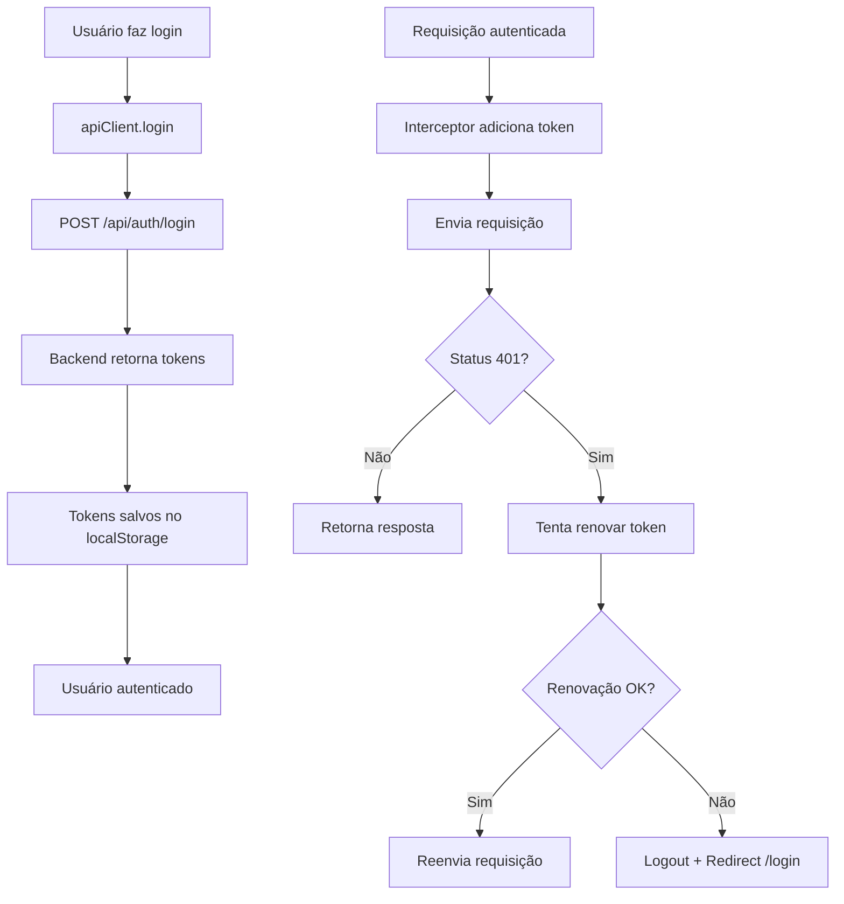

# API Service - Serviço de Comunicação com Backend

Serviço centralizado para comunicação com a API do TrendPulse.

## 📁 Arquivos

- **`api.ts`** - Serviço principal de API
- **`api.example.ts`** - Exemplos de uso

## ✨ Funcionalidades

### ✅ Requisitos Implementados

1. **POST para registro** - `http://localhost:8000/api/auth/register`
2. **POST para login** - `http://localhost:8000/api/auth/login`
3. **Armazenamento de tokens** - `access_token` e `refresh_token` no localStorage
4. **Interceptor de requests** - Adiciona `Authorization: Bearer <token>` automaticamente
5. **Tratamento de token expirado** - Renova token automaticamente em erros 401

### 🎯 Funcionalidades Extras

- ✅ Fila de requisições durante refresh de token
- ✅ Métodos genéricos (get, post, put, delete)
- ✅ Tratamento de erros padronizado
- ✅ TypeScript com tipos completos
- ✅ Singleton pattern
- ✅ SSR-safe (Next.js)

## 🚀 Como Usar

### Importar o serviço

```typescript
import { apiClient } from '@/services/api';
```

### 1. Registro de usuário

```typescript
const result = await apiClient.register({
  email: 'usuario@example.com',
  password: 'SenhaForte123',
  name: 'Nome do Usuário',
  preferred_language: 'pt_BR',
});

console.log(result.user); // Dados do usuário
console.log(result.message); // Mensagem de confirmação
```

### 2. Login

```typescript
const response = await apiClient.login({
  email: 'usuario@example.com',
  password: 'SenhaForte123',
  remember_me: true,
});

console.log(response.access_token); // Token de acesso
console.log(response.user); // Dados do usuário
// Tokens são armazenados automaticamente!
```

### 3. Requisições autenticadas

```typescript
// GET - Authorization header adicionado automaticamente
const trends = await apiClient.get('/api/trends');

// POST
const newTrend = await apiClient.post('/api/trends', {
  keyword: 'AI Tools',
  category: 'technology',
});

// PUT
const updated = await apiClient.put('/api/trends/123', {
  keyword: 'Updated',
});

// DELETE
await apiClient.delete('/api/trends/123');
```

### 4. Obter usuário atual

```typescript
const user = await apiClient.getCurrentUser();
```

### 5. Logout

```typescript
await apiClient.logout();
// Tokens são limpos e usuário é redirecionado para /login
```

### 6. Verificar autenticação

```typescript
const isAuth = apiClient.isAuthenticated();
const user = apiClient.getStoredUser();
```

## 🔒 Gerenciamento de Tokens

### Armazenamento

Os tokens são armazenados automaticamente no `localStorage`:
- `access_token` - Token de acesso (curta duração)
- `refresh_token` - Token de renovação (longa duração)
- `user` - Dados do usuário (JSON)

### Renovação Automática

Quando uma requisição retorna **401 Unauthorized**:

1. **Pausa** a requisição original
2. **Tenta renovar** o token usando o `refresh_token`
3. **Armazena** os novos tokens
4. **Reenvia** a requisição original com o novo token
5. Se falhar, **faz logout** e redireciona para `/login`

### Fila de Requisições

Durante a renovação do token, todas as requisições que falharam são colocadas em uma fila e reprocessadas após a renovação bem-sucedida.

## 🎨 Exemplo em Componente React

```typescript
'use client';

import { useState } from 'react';
import { apiClient } from '@/services/api';

export default function LoginForm() {
  const [email, setEmail] = useState('');
  const [password, setPassword] = useState('');
  const [loading, setLoading] = useState(false);
  const [error, setError] = useState('');

  const handleSubmit = async (e: React.FormEvent) => {
    e.preventDefault();
    setLoading(true);
    setError('');

    try {
      await apiClient.login({ email, password });
      window.location.href = '/dashboard';
    } catch (err: any) {
      setError(err.message);
    } finally {
      setLoading(false);
    }
  };

  return (
    <form onSubmit={handleSubmit}>
      <input
        type="email"
        value={email}
        onChange={(e) => setEmail(e.target.value)}
        placeholder="Email"
        required
      />
      <input
        type="password"
        value={password}
        onChange={(e) => setPassword(e.target.value)}
        placeholder="Senha"
        required
      />
      {error && <p className="error">{error}</p>}
      <button type="submit" disabled={loading}>
        {loading ? 'Entrando...' : 'Entrar'}
      </button>
    </form>
  );
}
```

## 🛡️ Proteção de Rotas

```typescript
'use client';

import { useEffect } from 'react';
import { useRouter } from 'next/navigation';
import { apiClient } from '@/services/api';

export default function ProtectedPage() {
  const router = useRouter();

  useEffect(() => {
    if (!apiClient.isAuthenticated()) {
      router.push('/login');
    }
  }, [router]);

  return <div>Conteúdo protegido</div>;
}
```

## 📝 Tipos TypeScript

Todos os tipos estão definidos em `api.ts`:

- `RegisterData` - Dados de registro
- `LoginData` - Dados de login
- `TokenResponse` - Resposta de login
- `User` - Dados do usuário

## 🔧 Configuração

O serviço usa a variável de ambiente:

```env
NEXT_PUBLIC_API_URL=http://localhost:8000
```

Se não definida, usa `http://localhost:8000` por padrão.

## 🎯 Endpoints Disponíveis

### Autenticação
- `POST /api/auth/register` - Registrar usuário
- `POST /api/auth/login` - Login
- `POST /api/auth/logout` - Logout
- `POST /api/auth/refresh` - Renovar token
- `GET /api/auth/me` - Obter perfil atual
- `POST /api/auth/forgot-password` - Solicitar reset de senha
- `POST /api/auth/reset-password` - Resetar senha
- `GET /api/auth/verify-email` - Verificar email

## 📦 Dependências

- `axios` - Cliente HTTP
- TypeScript types inclusos

## 🚨 Tratamento de Erros

Todos os métodos retornam erros padronizados:

```typescript
try {
  await apiClient.login(data);
} catch (error) {
  console.error(error.message); // Mensagem de erro do backend
}
```

## 🔄 Fluxo de Autenticação



## 📚 Mais Exemplos

Veja `api.example.ts` para mais exemplos de uso.
